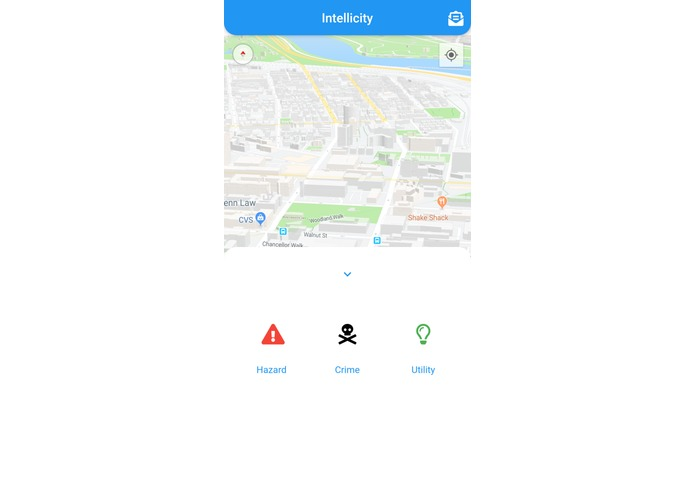

# Intellicity
A croudsourcing based risk management system built for PennApps 2019

*A screenshot of the Flutter-based application*

## Inspiration
Each living in a relatively suburban area, we are often quite confused when walking through larger cities. We can each associate with the frustration of not being able to find what seems to be even the simplest of things: a restroom nearby or a parking space we have been driving around endlessly to find. Unfortunately, we can also associate with the fear of danger present in many of these same cities. IntelliCity was designed to accommodate each one of these situations by providing users with a flexible, real-time app that reacts to the city around them.

## What it does
IntelliCity works by leveraging the power of crowdsourcing. Whenever users spot an object, event or place that fits into one of several categories, they can report it through a single button in our app. This is then relayed through our servers and other users on our app can view this report along with any associated images or descriptions, conveniently placed as a marker on a map.

## How we built it

IntelliCity was built using a variety of different frameworks and tools. Our front-end was designed using Flutter and the Google Maps API, which provided us with an efficient way to get geolocation data and place markers. Our backend was made using Flask and Google-Cloud.

## Challenges we ran into
Although we are quite happy with our final result, there were definitely a few hurdles we faced along the way. One of the most significant of these was properly optimizing our app for mobile devices, for which we were using Flutter, a relatively new framework for many of us. A significant challenge related to this was placing custom, location-dependent markers for individual reports. Another challenge we faced was transmitting the real-time data throughout our setup and having it finally appear on individual user accounts. Finally, a last challenge we faced was actually sending text messages to users when potential risks were identified in their area.

## Accomplishments that we're proud of
We are proud of getting a functional app for both mobile and web.

## What we learned
We learned a significant amount throughout this hackathon, about everything from using specific frameworks and APIS such as Flutter, Google-Maps, Flask and Twilio to communication and problem-solving skills.

## What's next for IntelliCity
In the future, we would like to add support for detailed analysis of specific cities.
